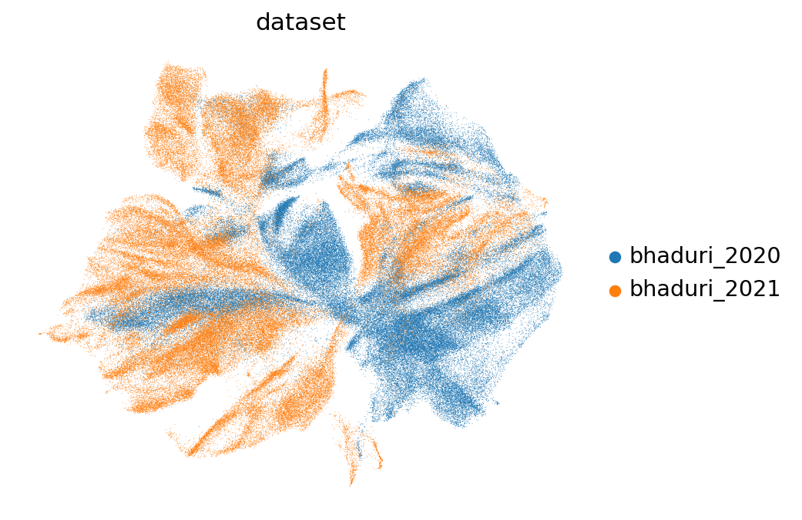
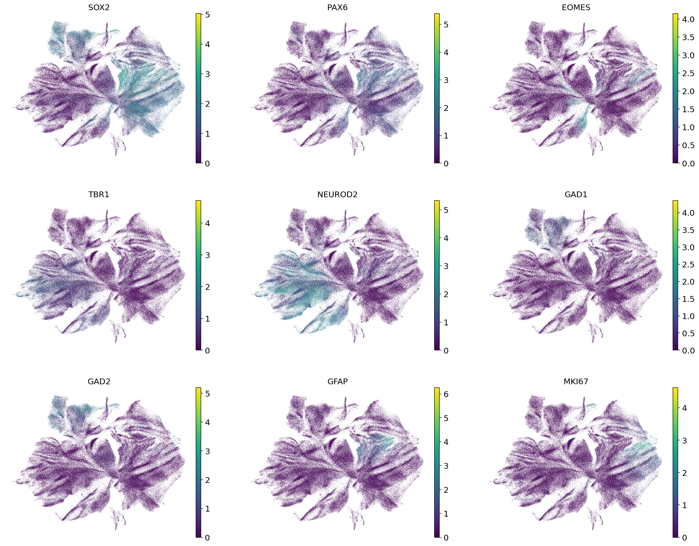
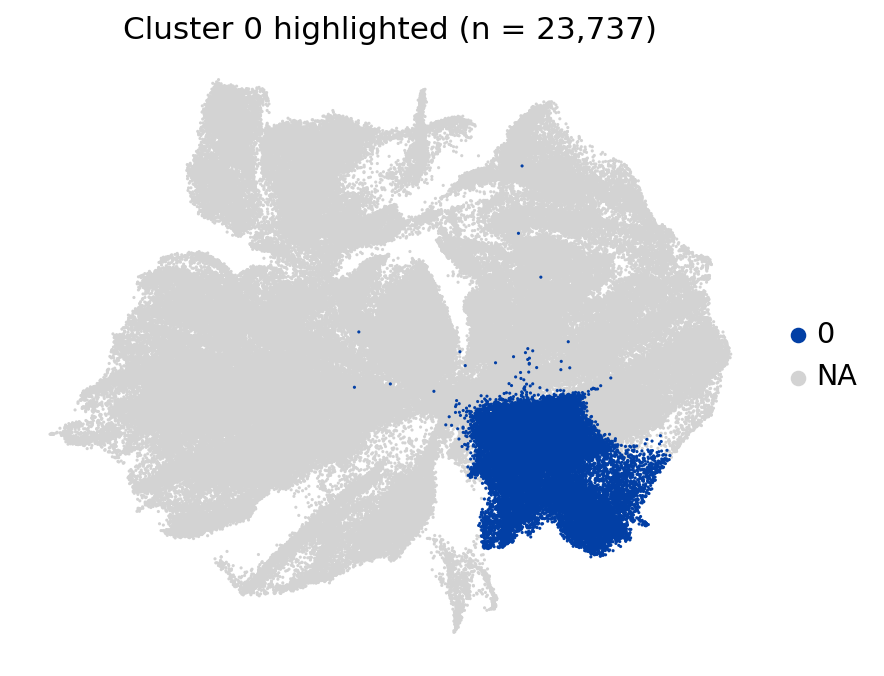
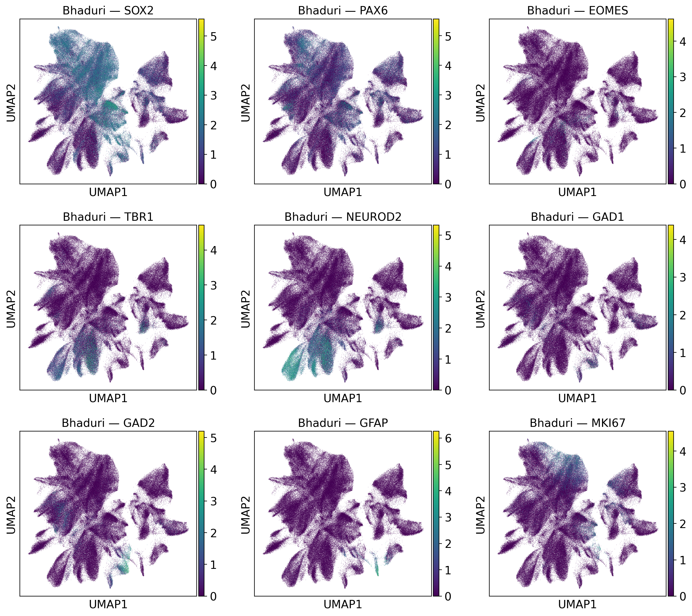
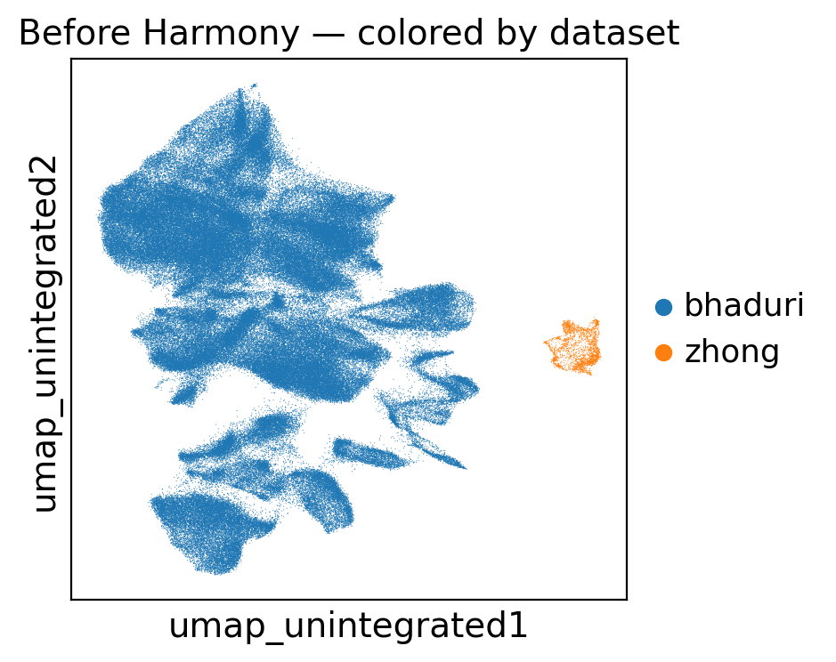
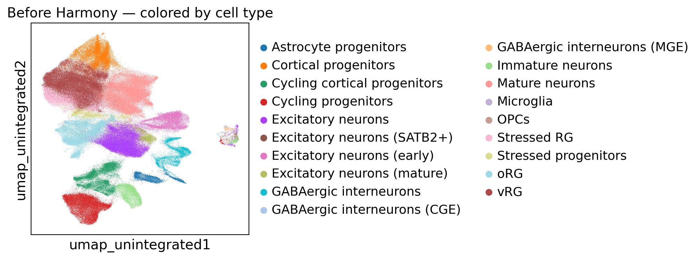

# Brain Organoid Trajectories

A learning project exploring single-cell RNA-seq analysis on human cortical-development data. Two large public datasets (Bhaduri 2020 organoids and Bhaduri 2021 fetal cortex), a scanpy pipeline from raw-matrix download through QC, clustering, and batch integration.

The original goal was a side-by-side comparison of transcriptional maturation trajectories between brain organoids and the fetal cortex. That cross-protocol comparison was not achieved — the batch-integration step could not bridge the organoid-vs-primary-tissue gap to a level supporting reliable joint trajectory inference, across four method/parameter configurations. The integration comparison itself is the most substantive analytical exercise here and is documented quantitatively below.

## Status

| Step | Status |
|---|---|
| 1. Data download (Bhaduri 2020 organoids, GEO) | done — 242k cells |
| 2. Data download (Bhaduri 2021 fetal, NeMO archive) | done — 396k cells |
| 3. Per-dataset QC / normalization / HVG / PCA / UMAP / Leiden | done on both datasets |
| 4. Stratified balanced subsample (100k + 100k) | done |
| 5. Batch integration | done; four configurations benchmarked, consistent failure mode (table below) |
| 6. Cell-type annotation on integrated object | not pursued — depends on (5) succeeding |
| 7. Trajectory inference (PAGA + DPT) | diagnostic only — failure modes documented in `colab_05_trajectory_zhong2018` (Session 15) |
| 8. Cross-dataset trajectory comparison | not pursued — depends on (5) and (7) succeeding |

## Integration method comparison

Goal: produce a joint embedding of 100k organoid + 100k fetal cells where shared cell types (radial glia in particular) co-cluster across datasets.



*Joint UMAP after Harmony (default config, `colab_08`), colored by dataset. Successful integration would show the two colors intermixed within each cell-type region; what's visible instead is dataset-segregated territories.*

| Notebook | Method | Configuration | Cells in >95%-pure clusters | Dominant RG cluster | Fetal RG enrichment |
|---|---|---|---|---|---|
| colab_08  | Harmony   | 2,000 union HVGs, theta=2 (default) | ca. 41% | 0  (98.7% organoid) | 6.66x |
| colab_08b | Harmony   | 751 intersect HVGs, theta=2         | ca. 61% | 5  (87.2% fetal)    | 6.69x |
| colab_08c | Harmony   | 2,000 union HVGs, theta=4           | ca. 41% | 13 (99.5% fetal)    | 4.53x |
| colab_08d | scanorama | 2,000 union HVGs, dimred=30         | ca. 69% | 14 (99.98% fetal)   | 4.33x |

Same failure mode rotated four ways: each run produces one high-purity radial-glia cluster, but which side dominates rotates between configurations, and the share of cells in >95%-pure clusters never drops to a level supporting cross-dataset trajectory inference. scVI was the planned escalation but is unavailable here — `colab_07b` verified that the GEO-archived Bhaduri 2020 expression matrix is `cellranger aggr --normalize=mapped` output (library-size-normalized, non-integer values), not raw counts, so scVI's count-likelihood model cannot be applied without re-running cellranger from SRA fastqs.



*Lineage markers on the same integrated embedding (`colab_08`). The biological structure is intact — radial-glia, IPC, excitatory and interneuron territories are recognizable — so the integration failure isn't from loss of signal, it's from the dataset axis dominating over the biological axis.*

### Cluster-level diagnostic



*Cluster 0 highlighted on the joint UMAP (`colab_09`). 98.7% of its cells come from Bhaduri 2020 (organoids). This is the "dominant RG cluster" cited in the table for the Harmony-default run — a radial-glia subtype where Harmony failed to bridge the protocol gap, so the cluster ends up almost entirely from one side.*

The result is consistent with reports that organoid-vs-primary-tissue integration is unusually hard despite same-lab / same-chemistry origins. Documented here as a case study with quantitative diagnostics.

## Datasets

| Dataset | Role | Source | Cells loaded |
|---|---|---|---|
| **Bhaduri et al. 2020** | Brain organoids (3 protocols, GW3–24) | GEO: [GSE132672](https://www.ncbi.nlm.nih.gov/geo/query/acc.cgi?acc=GSE132672) | 241,776 |
| **Bhaduri et al. 2021** | Fetal cortex atlas (GW14–25, 11 donors) | NeMO archive (cortical subset) | 396,186 |

Same lab, same 10x Chromium v2 chemistry. The Bhaduri 2021 download required parsing three different NeMO URL conventions, merging split-lane samples per UCSC sample, and joining against the UCSC `dev-brain-regions` cell metadata for cell-type labels — see `colab_06`.



*Per-dataset UMAP for Bhaduri 2020 organoids (`colab_02`), with cell-type marker genes overlaid. Each dataset on its own produces a coherent embedding with the expected lineage structure; the difficulty arises only at the joint integration step.*

### Why Bhaduri 2021 over Zhong 2018?

The first fetal partner attempted in this project was Zhong et al. 2018 (`colab_03/04/05_zhong2018`). It was abandoned in favor of Bhaduri 2021 for two reasons visible in the pre-integration UMAP: a heavy cell-count imbalance (Zhong is ca. 100× smaller than the organoid dataset) and a cell-type composition mismatch that left only a thin overlap of shared types for any joint embedding to anchor on.



*Pre-Harmony UMAP of the two datasets concatenated. The Zhong sample (one color) is a small ribbon next to the much larger Bhaduri 2020 cloud — a size imbalance Harmony cannot fix.*



*Same pre-Harmony UMAP, colored by cell type. The two datasets occupy non-overlapping regions of the embedding even where they share cell-type labels — the joint biology Harmony needs to learn from is mostly missing.*

Bhaduri 2021 (same lab, same chemistry, balanced cell-count) was substituted as the fetal partner from `colab_06` onward.

## What's in the repo

### Reusable code (`src/`)

- `utils.py` — path helpers, data loading, saving (sparse-aware)
- `preprocessing.py` — QC metrics, filtering, normalization, HVG, PCA
- `visualization.py` — QC plots, UMAP, scree plot; auto-saves to `results/figures/`

### Notebooks

| Notebook | Purpose |
|---|---|
| `colab_00_data_download` | Bhaduri 2020 GEO download + h5ad save |
| `colab_01_preprocessing` | QC, normalization, HVG, PCA on both datasets |
| `colab_02_umap_clustering` | Per-dataset UMAP, Leiden, marker genes |
| `colab_03_integration_zhong2018` | First integration attempt (Bhaduri 2020 + Zhong 2018 fetal partner, later superseded) |
| `colab_04_annotation_zhong2018` | Annotation of the 19-cluster Zhong-based integrated object |
| `colab_05_trajectory_zhong2018` | PAGA + DPT on the Zhong-based object — documented diagnostic failure modes |
| `colab_06_bhaduri2021_download` | NeMO download with 3 URL conventions, 396k cells |
| `colab_07_stratified_subsample` | Largest-remainder stratified 100k subsample |
| `colab_07b_bhaduri2020_recount` | Verified GEO matrix is normalized, not raw |
| `colab_08_integration_balanced` | Harmony default, 200k cells |
| `colab_08b_integration_intersect_hvg` | Harmony, 751 intersect HVGs |
| `colab_08c_integration_theta4` | Harmony, theta=4 |
| `colab_08d_integration_scanorama` | scanorama panorama integration |
| `colab_09_cluster0_annotation` | Targeted diagnostic on cluster 0 (98.7% organoid) |

### Compute split

- **Local (laptop):** code authoring and `src/` modules.
- **Google Colab (paid):** all heavy compute on real datasets.
- **Google Drive:** all `.h5ad` files (multi-GB each); never on GitHub.
- **GitHub:** code, empty Colab notebooks, and the session log only.

### Notebook lifecycle

Three-phase pattern, applied per session:

1. **Authoring** — committed to GitHub in `notebooks/colab/`. Code cells with cell-ID headers (`### 6a — ...`), short pre-cell explanations, no output, no findings.
2. **Run on Colab** — execute with Drive mounted. Outputs generated.
3. **`_WITH_OUTPUT` archive** — download the run notebook into `outputs/`. Interpretive markdown cells added after each code cell with observed results. Output notebooks for the pipeline and benchmark steps are tracked in this repo; the superseded Zhong-arc outputs remain local-only.

## Project structure

```
brain-organoid-trajectories/
├── notebooks/
│   └── colab/                     <- Colab pipeline (14 notebooks)
├── outputs/                       <- run-output notebooks (pipeline + benchmark tracked; Zhong-arc local-only)
├── src/                           <- reusable scanpy modules
├── NOTES.md                       <- session-by-session log
├── requirements.txt
└── README.md
```

Data is not tracked — `.h5ad` files live on Google Drive at `/content/drive/MyDrive/brain-organoid-trajectories/data/`.

## Reproducing

```bash
# Local environment for src/ modules
python -m venv venv
source venv/bin/activate          # Windows: venv\Scripts\activate
pip install -r requirements.txt
```

Colab notebooks expect the project Drive folder mounted at `/content/drive/MyDrive/brain-organoid-trajectories/`. Each notebook is self-contained: a `pip install` cell lives at the top of every notebook, so any single notebook can be run without preparing the rest of the environment.

## Marker genes used (cortical lineage)

| Cell type | Markers |
|---|---|
| Radial glia (vRG) | SOX2, VIM, NES, PAX6, FABP7, HES1 |
| Outer RG (oRG) | HOPX, TNC, PTPRZ1, MOXD1, FAM107A |
| Intermediate progenitors | EOMES, PPP1R17, NEUROG1, NEUROG2 |
| Excitatory neuron | NEUROD2, NEUROD6, SLC17A7, TBR1, BCL11B, FEZF2, SATB2, CUX2 |
| Inhibitory neuron | GAD1, GAD2, DLX1, DLX2, DLX5 |
| MGE-derived | LHX6, NKX2-1, SST |
| CGE-derived | NR2F2, SP8, PROX1 |
| OPC | OLIG1, OLIG2, PDGFRA, SOX10 |
| Astrocyte | GFAP, AQP4, S100B, ALDH1L1 |
| Microglia | AIF1, CX3CR1, P2RY12, C1QA |
| Cycling | MKI67, TOP2A, PCNA |
| Choroid plexus (organoid off-target) | TTR (specific), KRT18, OTX2 |

## Session log

Detailed per-session notes — what was run, what was observed, what broke, what was decided — in [`NOTES.md`](NOTES.md).
